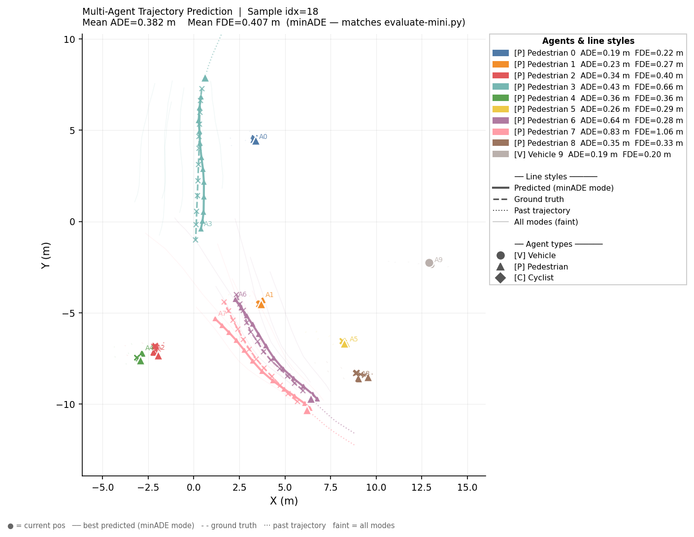
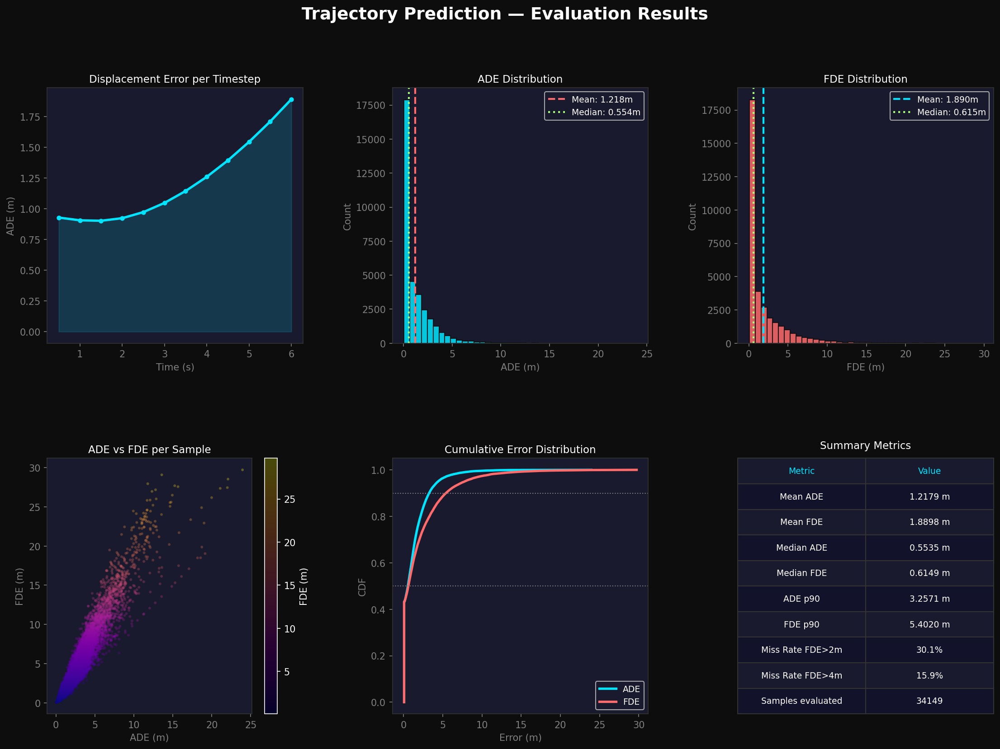

# Zero-Latency — Trajectory Prediction Pipeline

A multi-modal transformer-based trajectory prediction model trained on the nuScenes dataset. The model predicts future trajectories of traffic agents (vehicles, pedestrians, cyclists) using historical motion data and scene context.

---

## Prediction results

The visualisation below shows the model predicting 6 seconds of future trajectories for all agents in a single scene. Solid lines are the model's best prediction (minADE mode), dashed lines are ground truth, and faint lines show all K=6 predicted modes.



---

## Project overview

Zero-Latency is a trajectory prediction pipeline built on a multi-stage transformer architecture. Given a sequence of past agent positions and scene context, the model predicts multiple plausible future trajectories with associated probabilities.

The pipeline consists of six learned modules working in sequence:

1. **InputEmbedding** — encodes raw per-agent features (position, velocity, heading, agent type) into transformer-ready tokens
2. **TemporalTransformer** — models each agent's motion history over time
3. **SocialTransformer** — models interactions between agents at each timestep
4. **SceneContextEncoder** — fuses agent representations with map context via cross-attention
5. **GoalPredictionNetwork** — predicts a distribution over likely goal positions
6. **MultiModalDecoder** — generates K future trajectory modes conditioned on predicted goals

---

## Model architecture

```
Input: (batch, time=6, agents=10, features=8)
         ↓
InputEmbedding          ~0.5M params
         ↓
TemporalTransformer     ~110M params
         ↓
SocialTransformer       ~42M params
         ↓
SceneContextEncoder     ~28M params
         ↓
GoalPredictionNetwork   ~0.6M params
         ↓
MultiModalDecoder       ~82M params
         ↓
Output: (batch, K=6, agents, time=12, 2)
```

**Total parameters: ~263M**

Each future timestep is 0.5 seconds apart — the model predicts 6 seconds into the future.

---

## Dataset

This project uses the [nuScenes dataset](https://www.nuscenes.org/). Registration is required to download.

| Version | Samples | Scenes | Size |
|---|---|---|---|
| `v1.0-mini` | 404 | 10 | 3.9 GB |
| `v1.0-trainval` | 34,149 | 850 | ~300 GB (10 parts) |
| `v1.0-test` | 6,008 | 150 | ~54 GB |

Download links for aria2 are available in `data/links.txt`.

---

## Results

### Evaluation on v1.0-mini (404 samples)

```
Samples evaluated : 404
Loss              : 1.6108
ADE               : 0.5972 m
FDE               : 1.0135 m
```

### Evaluation on v1.0-trainval parts 9–10 (held-out, never seen during training)

The model was trained on parts 1–8 and evaluated on parts 9–10.

```
Samples evaluated : 34,149
Mean ADE          : 0.8412 m
Mean FDE          : 1.0704 m
Median ADE        : 0.5231 m
Median FDE        : 0.5819 m
ADE p90           : 1.9242 m
FDE p90           : 2.6094 m
Miss Rate FDE>2m  : 16.7%
Miss Rate FDE>4m  :  3.3%
```

### Evaluation plots



---

## Repository structure

```
zero-latency/
├── checkpoints/                     # raw training checkpoints (saved during training)
│   └── best_1.pt
├── configs/
├── data/
│   ├── processed/
│   └── raw/
│       └── nuscenes/                # v1.0-mini dataset goes here
├── dataset/
├── evaluation_results/
│   └── evaluation_results.png
├── models/                          # exported inference-ready model weights
│   ├── model_fp16.pt                # half-precision export (~500 MB)
│   └── model_fp32.pt                # full-precision export (~1 GB)
├── modules/
│   ├── decoder/
│   ├── scene/
│   └── social/
├── nuscenes/                        # v1.0-trainval dataset goes here
│   ├── maps/
│   ├── samples/
│   ├── sweeps/
│   └── v1.0-trainval/
├── pipeline-architecture/
├── utils/
├── visualisations/                  # output PNGs and MP4s from single_inference.py
│   ├── multi_agent_prediction.png
│   └── multi_agent_prediction.mp4
├── .gitignore
├── README.md
├── evaluate-mini.py
├── evaluate-trainval.py
├── export_model.py          # exports best checkpoint → models/ folder
├── requirements.txt
├── setup.sh
├── single_inference.py      # run inference + visualise a single scene
├── train-linux-32GB-VRAM.py
└── train-windows-8GB-VRAM.py
```

---

## Configuring file paths

Every script in this repo has a **CONFIG block near the top** — this is the only place you need to edit paths. Nothing is hardcoded anywhere else.

### `single_inference.py`

All paths are relative to the repo root and work on any machine after cloning. If you keep your dataset or model weights somewhere else, update the relevant variables at the top of the script. Or if you want to use absolute path use raw strings (`r"C:\..."`).

The script accepts command-line arguments so you can override behaviour without editing the file:

```powershell
python single_inference.py                     # mini dataset, random scene
python single_inference.py --trainval          # use trainval dataset instead
python single_inference.py --seed 42           # reproducible scene
python single_inference.py --no_anim           # skip MP4, PNG only
```

### `evaluate-mini.py` / `evaluate-trainval.py`

Both scripts have a config block at the top. All paths are relative to the repo root. If you have placed your datasets somewhere else just replace them. Or if you want to use absolute path use raw strings (`r"C:\..."`).

**`evaluate-mini.py`:**
```python
CHECKPOINT_PATH = "models/model_fp32.pt"
DATAROOT        = "data/raw/nuscenes"
VERSION         = "v1.0-mini"
BATCH_SIZE      = 4
```

**`evaluate-trainval.py`:**
```python
CHECKPOINT_PATH = "models/model_fp32.pt"
DATAROOT        = "nuscenes"
VERSION         = "v1.0-trainval"
BATCH_SIZE      = 64
OUTPUT_DIR      = "evaluation_results"
```

### `export_model.py`

Uses `argparse` — paths are passed as command-line arguments with sensible defaults:

```powershell
python export_model.py                                    # uses defaults below
python export_model.py --checkpoint checkpoints/best_1.pt --output models
```

| Argument | Default | Description |
|---|---|---|
| `--checkpoint` | `checkpoints/best_1.pt` | Path to the raw training checkpoint |
| `--output` | `models` | Folder where exported weights are written |

This writes two files into `models/`: `model_fp32.pt` and `model_fp16.pt`.

> **Tip:** All pre-trained model weights (`model_fp16.pt`, `model_fp32.pt`, `best_1.pt`) are available in the [shared Google Drive folder](https://drive.google.com/drive/folders/16s7dJhrjQLzVtm-OpdlNWsWP6TRgp2OP?usp=sharing). You do not need to train from scratch to run inference.

---

## Setup & installation

### Windows (8 GB VRAM)

#### 1. Clone the repo

```powershell
git clone https://github.com/Aurora-source/zero-latency.git
cd zero-latency
git checkout working-rikon
```

#### 2. Create a virtual environment

```powershell
python -m venv venv
venv\Scripts\activate
```

#### 3. Install PyTorch (CUDA 12.8 nightly)

```powershell
pip install --pre torch torchvision torchaudio --index-url https://download.pytorch.org/whl/nightly/cu128
```

#### 4. Install Python dependencies

```powershell
pip install cachetools==7.0.5 colorama==0.4.6 contourpy==1.3.3 cycler==0.12.1 descartes==1.1.0 filelock==3.25.2 fire==0.7.1 fonttools==4.62.1 fsspec==2026.2.0 Jinja2==3.1.6 joblib==1.5.3 kiwisolver==1.5.0 MarkupSafe==3.0.3 matplotlib==3.10.8 mpmath==1.3.0 networkx==3.6.1 numpy==2.4.3 opencv-python-headless==4.13.0.92 packaging==26.0 pandas==3.0.1 parameterized==0.9.0 pillow==12.1.1 pycocotools==2.0.11 pyparsing==3.3.2 pyquaternion==0.9.9 python-dateutil==2.9.0.post0 PyYAML==6.0.3 scikit-learn==1.8.0 scipy==1.17.1 setuptools==78.1.0 shapely==2.1.2 six==1.17.0 sympy==1.14.0 termcolor==3.3.0 threadpoolctl==3.6.0 tqdm==4.67.3 typing_extensions==4.15.0 tzdata==2025.3
```

```powershell
pip install "nuscenes-devkit==1.2.0" --no-deps
pip install cachetools descartes fire opencv-python-headless parameterized pycocotools pyquaternion scikit-learn scipy shapely
```

#### 5. Install FFmpeg (required for animation output)

`single_inference.py` saves an animated `.mp4` of the predicted trajectories. FFmpeg must be on your system PATH for this to work.

**Option A — winget (Windows 10/11):**
```powershell
winget install --id Gyan.FFmpeg -e
```

**Option B — manual install:**
1. Download a build from [ffmpeg.org/download.html](https://ffmpeg.org/download.html) (recommended: the *full* build from gyan.dev)
2. Extract to a folder such as `C:\ffmpeg`
3. Add `C:\ffmpeg\bin` to your system PATH:
   - Search "Environment Variables" in the Start menu
   - Edit `Path` under System Variables → New → `C:\ffmpeg\bin`
4. Open a new terminal and verify:

```powershell
ffmpeg -version
```

If `ffmpeg -version` prints a version string, the animation export will work. If FFmpeg is not found, `single_inference.py` still runs and saves the static PNG — only the MP4 is skipped.

#### 6. Download the nuScenes mini dataset

Register at [nuscenes.org](https://www.nuscenes.org/) and download `v1.0-mini`. Extract it to:

```
data/raw/nuscenes/
```

#### 7. Download model weights

All model weights, the mini dataset, and the project presentation are available in the shared Google Drive folder:

**[Download from Google Drive](https://drive.google.com/drive/folders/16s7dJhrjQLzVtm-OpdlNWsWP6TRgp2OP?usp=sharing)**

The folder is organised as follows:

| Folder / File | Description |
|---|---|
| `checkpoints/best_1.pt` | Raw training checkpoint (~1 GB) |
| `models/model_fp32.pt` | Exported full-precision model — recommended for inference (~1 GB) |
| `models/model_fp16.pt` | Exported half-precision model — faster, slightly lower accuracy (~500 MB) |
| `nuscenes/` | nuScenes mini dataset with metadata pre-compressed as `.tar` |
| `zero-latency.pptx` | Hackathon presentation |

Place the downloaded files in the correct local folders:

```
checkpoints/
└── best_1.pt

models/
├── model_fp32.pt
└── model_fp16.pt
```

#### 8. (Optional) Download trainval metadata for full dataset evaluation

Download the trainval metadata from the same [Google Drive folder](https://drive.google.com/drive/folders/16s7dJhrjQLzVtm-OpdlNWsWP6TRgp2OP?usp=sharing) and extract it into `nuscenes/` at the repo root:

```
nuscenes/
└── v1.0-trainval/
    ├── scene.json
    ├── sample.json
    └── ...
```

Then download sensor blob parts (each ~30 GB) from [nuscenes.org](https://www.nuscenes.org/) and extract them into the same `nuscenes/` folder. All parts merge automatically into `nuscenes/samples/` and `nuscenes/sweeps/`.

#### 9. Verify setup

```powershell
python -c "import torch; print(torch.__version__); print(torch.cuda.get_device_name(0))"
ffmpeg -version
```

---

### Cloud (Linux, RTX 5090 — vast.ai)

#### 1. Run setup script

```bash
bash setup.sh
```

This script handles everything in one shot — clone, checkout, all Python dependencies, PyTorch cu128 nightly, and a verification check at the end. The full script is reproduced below for reference:

```bash
#!/bin/bash
set -e  
echo "Cloning repo"
git clone https://github.com/Aurora-source/zero-latency.git
cd zero-latency
git checkout working-rikon

echo "Installing dependencies (excluding torch)"
pip install \
  cachetools==7.0.5 \
  colorama==0.4.6 \
  contourpy==1.3.3 \
  cycler==0.12.1 \
  descartes==1.1.0 \
  filelock==3.25.2 \
  fire==0.7.1 \
  fonttools==4.62.1 \
  fsspec==2026.2.0 \
  Jinja2==3.1.6 \
  joblib==1.5.3 \
  kiwisolver==1.5.0 \
  MarkupSafe==3.0.3 \
  matplotlib==3.10.8 \
  mpmath==1.3.0 \
  networkx==3.6.1 \
  numpy==2.4.3 \
  "nuscenes-devkit==1.2.0" --no-deps \
  opencv-python-headless==4.13.0.92 \
  packaging==26.0 \
  pandas==3.0.1 \
  parameterized==0.9.0 \
  pillow==12.1.1 \
  pycocotools==2.0.11 \
  pyparsing==3.3.2 \
  pyquaternion==0.9.9 \
  python-dateutil==2.9.0.post0 \
  PyYAML==6.0.3 \
  scikit-learn==1.8.0 \
  scipy==1.17.1 \
  setuptools==78.1.0 \
  shapely==2.1.2 \
  six==1.17.0 \
  sympy==1.14.0 \
  termcolor==3.3.0 \
  threadpoolctl==3.6.0 \
  tqdm==4.67.3 \
  typing_extensions==4.15.0 \
  tzdata==2025.3

echo "    Installing PyTorch (cu128 nightly)    "
pip install --pre torch torchvision torchaudio \
  --index-url https://download.pytorch.org/whl/nightly/cu128

echo "    Installing remaining nuscenes-devkit deps    "
pip install cachetools descartes fire \
  opencv-python-headless parameterized pycocotools \
  pyquaternion scikit-learn scipy shapely

echo "    Verifying install    "
python -c "
import torch
print('PyTorch:', torch.__version__)
print('CUDA available:', torch.cuda.is_available())
print('GPU:', torch.cuda.get_device_name(0) if torch.cuda.is_available() else 'None')
from nuscenes.nuscenes import NuScenes
print('nuscenes: OK')
"

echo "    Setup complete!    "
echo "Next: download nuscenes data using aria2 with links.txt"
echo "Then run: NUSCENES_ROOT=/workspace/zero-latency/nuscenes python train.py"
```

#### 2. Install FFmpeg

FFmpeg is usually pre-installed on most cloud images. Verify with:

```bash
ffmpeg -version
```

If it is missing:

```bash
apt-get update && apt-get install -y ffmpeg
```

#### 3. Set up rclone ([Google Drive](https://drive.google.com/drive/folders/16s7dJhrjQLzVtm-OpdlNWsWP6TRgp2OP?usp=sharing) access)

rclone is used on the cloud server to pull the latest checkpoint from [Google Drive](https://drive.google.com/drive/folders/16s7dJhrjQLzVtm-OpdlNWsWP6TRgp2OP?usp=sharing) before training starts, and to push the new best checkpoint back up when training finishes. On Windows you don't need rclone — just use [Google Drive](https://drive.google.com/drive/folders/16s7dJhrjQLzVtm-OpdlNWsWP6TRgp2OP?usp=sharing) in the browser directly.

```bash
# Install rclone
curl https://rclone.org/install.sh | sudo bash

# Configure Google Drive
rclone config
# Follow the prompts:
#   n          → new remote
#   name:        Rikon  (or your preferred name — use this name in all rclone commands)
#   Storage:     drive
#   client_id:   (leave blank)
#   client_secret: (leave blank)
#   scope:       1  (full access)
#   auto config: n  (we are on a remote server with no browser)
#   Copy the URL shown → open it in your local browser → approve access → paste the code back
#   Shared Drive: n
#   Confirm with: y
```

#### 4. Download nuScenes dataset

`links.txt` is already in the repo at `data/links.txt` — no need to download it separately.

```bash
apt-get install -y aria2

mkdir -p /workspace/zero-latency/nuscenes
cd /workspace/zero-latency/nuscenes

# Download all parts using links.txt from the repo
aria2c -c -j 2 -x 8 -s 8 -k 1M --file-allocation=falloc --dir=. \
  -i /workspace/zero-latency/data/links.txt
```

#### 5. Extract dataset (one part at a time to save disk space)

```bash
tar -xzf v1.0-trainval_meta.tgz    && rm v1.0-trainval_meta.tgz
tar -xzf v1.0-trainval01_blobs.tgz && rm v1.0-trainval01_blobs.tgz
tar -xzf v1.0-trainval02_blobs.tgz && rm v1.0-trainval02_blobs.tgz
# repeat for remaining parts...
```

Expected structure after extraction:

```
nuscenes/
├── maps/
│   └── prediction/
│       └── prediction_scenes.json
├── samples/
├── sweeps/
└── v1.0-trainval/
```

#### 6. Download latest checkpoint

```bash
rclone copy "Rikon:zero-latency/checkpoints/best_1.pt" \
  /workspace/zero-latency/checkpoints/
```

---

## How to run

### Export model weights

Before running inference, export the raw training checkpoint to inference-ready formats:

```powershell
python export_model.py
```

This reads `checkpoints/best_1.pt` and writes two files into `models/`:

- `model_fp32.pt` — full-precision weights (~1 GB)
- `model_fp16.pt` — half-precision weights (~500 MB)

If you downloaded the exported weights directly from [Google Drive](https://drive.google.com/drive/folders/16s7dJhrjQLzVtm-OpdlNWsWP6TRgp2OP?usp=sharing), skip this step.

### Single-scene inference and visualisation

```powershell
python single_inference.py                     # mini dataset, random scene
python single_inference.py --trainval          # use trainval dataset instead
python single_inference.py --seed 42           # reproducible scene
python single_inference.py --no_anim           # skip MP4, PNG only
```

Picks a random moving scene, runs a full forward pass, prints per-agent ADE/FDE (guaranteed to match `evaluate-mini.py`), and saves:

- `visualisations/multi_agent_prediction.png` — static visualisation, legend outside the plot area
- `visualisations/multi_agent_prediction.mp4` — animated visualisation, trajectories grow step by step (requires FFmpeg)

To reproduce a specific scene, pass `--seed` with the sample index printed at the end of any previous run:

```powershell
python single_inference.py --seed 177
# printed as: "To reproduce this scene: set SEED = 177"
```

### Training

**Windows (local):**
```powershell
python train-windows-8GB-VRAM.py
```

**Cloud (Linux) — one run takes ~2 hours on RTX 5090:**
```bash
NUSCENES_ROOT=/workspace/zero-latency/nuscenes \
TORCH_COMPILE_MODE=reduce-overhead \
BATCH_SIZE=72 \
EVAL_BATCH_SIZE=16 \
python train-linux-32GB-VRAM.py
```

Training automatically resumes from `checkpoints/best_1.pt`. To start from scratch:

```bash
RESUME=0 python train-linux-32GB-VRAM.py
```

### Evaluation

**Mini dataset:**
```powershell
python evaluate-mini.py
```

**Full trainval dataset:**
```powershell
python evaluate-trainval.py --dataroot "nuscenes" --batch_size 32
```

Saves plots to `evaluation_results/evaluation_results.png`.

### Syncing checkpoints via [Google Drive](https://drive.google.com/drive/folders/16s7dJhrjQLzVtm-OpdlNWsWP6TRgp2OP?usp=sharing)

**On the cloud server — pull the previous best checkpoint before training:**

```bash
rclone copy "Rikon:zero-latency/checkpoints/best_1.pt" \
  /workspace/zero-latency/checkpoints/ --progress
```

**On the cloud server — push the new best checkpoint after training finishes:**

```bash
rclone copy /workspace/zero-latency/checkpoints/best_1.pt \
  Rikon:zero-latency/checkpoints/ --progress
```

**On Windows** — no rclone needed. Open the [shared Google Drive folder](https://drive.google.com/drive/folders/16s7dJhrjQLzVtm-OpdlNWsWP6TRgp2OP?usp=sharing) in your browser to download weights, or navigate to `zero-latency/checkpoints/` in your own Drive to upload a new checkpoint after cloud training.

---

## Training configuration

### Key environment variables

| Variable | Default | Description |
|---|---|---|
| `NUSCENES_ROOT` | `data/raw/nuscenes` | Path to nuScenes dataset |
| `DATASET_LIMIT` | `6000` | Max samples to load per run |
| `BATCH_SIZE` | `72` (cloud) / `4` (Windows) | Micro batch size |
| `GRAD_ACCUM_STEPS` | `1` | Gradient accumulation steps |
| `LR` | `5e-5` | Learning rate |
| `RUN_EPOCHS` | `40` | Epochs per run |
| `RESUME` | `1` | Auto-resume from best checkpoint |
| `TORCH_COMPILE` | `1` | Enable torch.compile (Linux only) |
| `CHECKPOINT_DIR` | `checkpoints` | Where to save checkpoints |

---

## Hardware requirements

| Component | Minimum | Recommended |
|---|---|---|
| GPU VRAM | 8 GB | 32 GB |
| RAM | 16 GB | 64 GB+ |
| Disk | 50 GB | 500 GB |
| CUDA | 12.8+ | 13.0+ |

### Tested configurations

| Setup | Script | Batch size | Time per run |
|---|---|---|---|
| RTX 5060 Laptop (8 GB VRAM, 16 GB RAM, Windows) | `train-windows-8GB-VRAM.py` | 32 | ~15 min (mini) |
| RTX 5070 Laptop (8 GB VRAM, 16 GB RAM, Windows) | `train-windows-8GB-VRAM.py` | 32 | ~12 min (mini) |
| RTX 5090 Cloud (32 GB VRAM ,256 GB RAM , Linux) | `train-linux-32GB-VRAM.py` | 72 | ~2 hours (trainval) |
